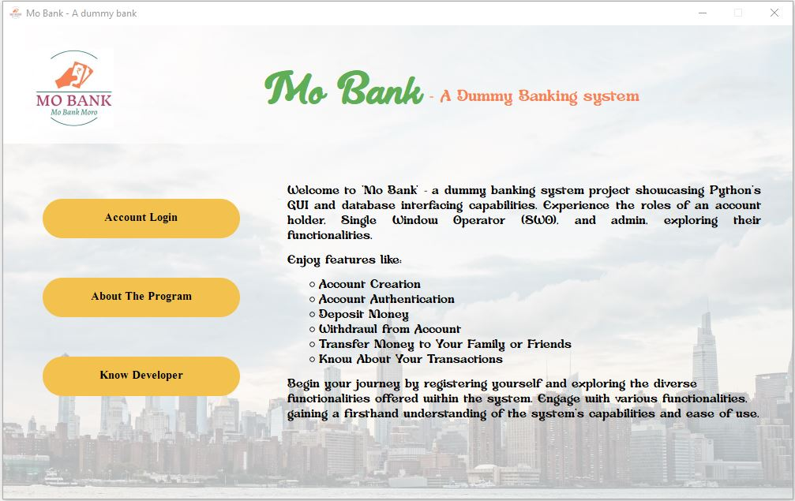
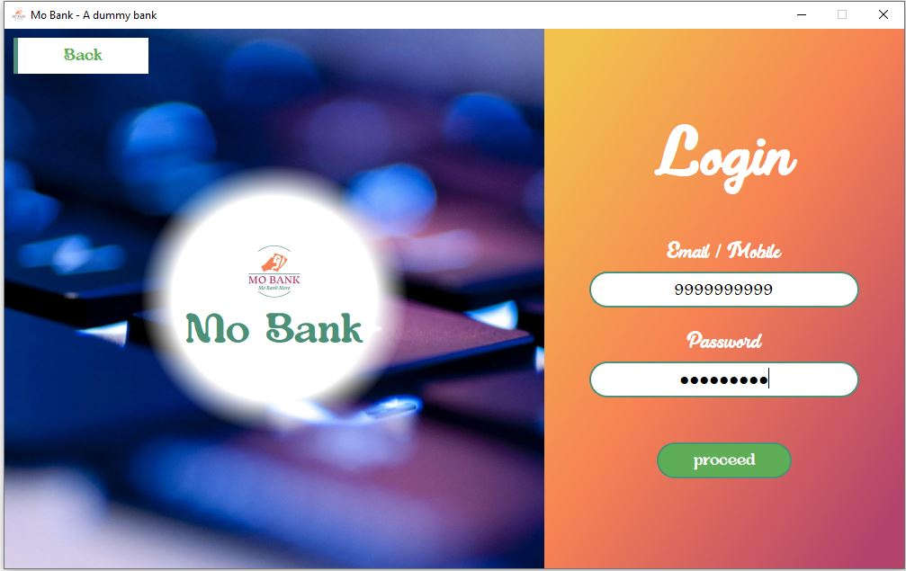
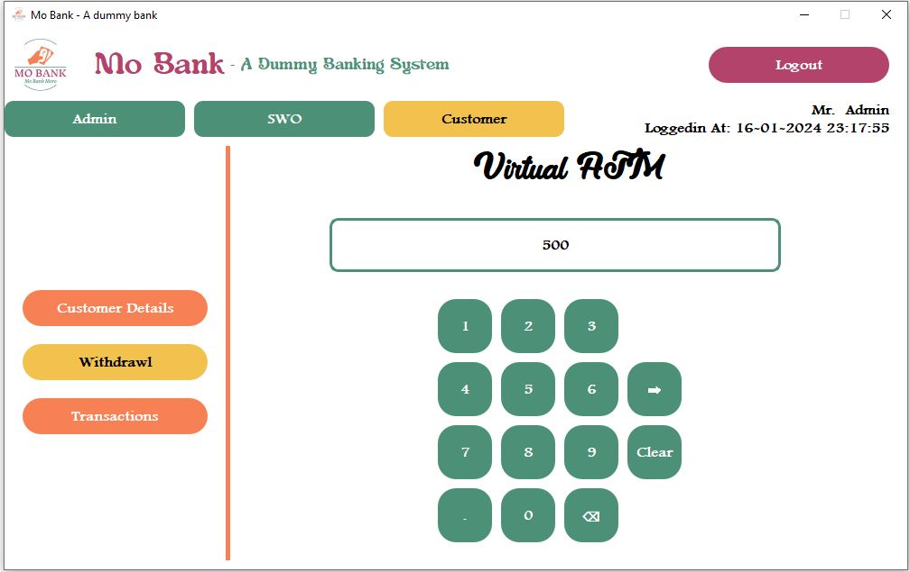
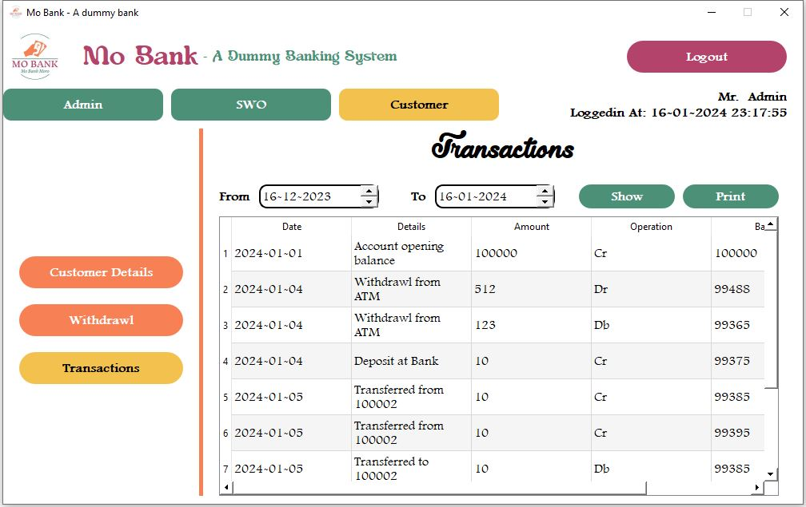
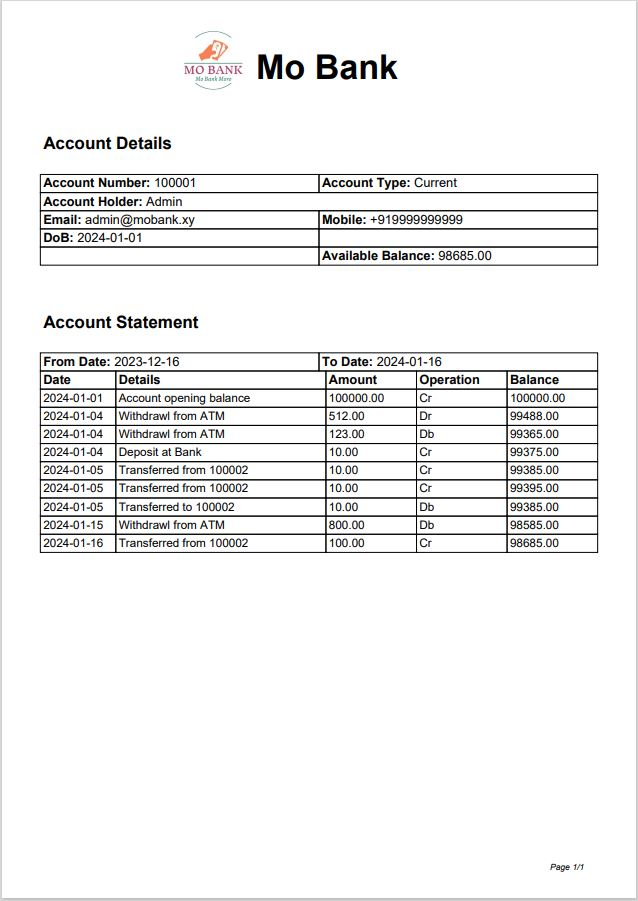
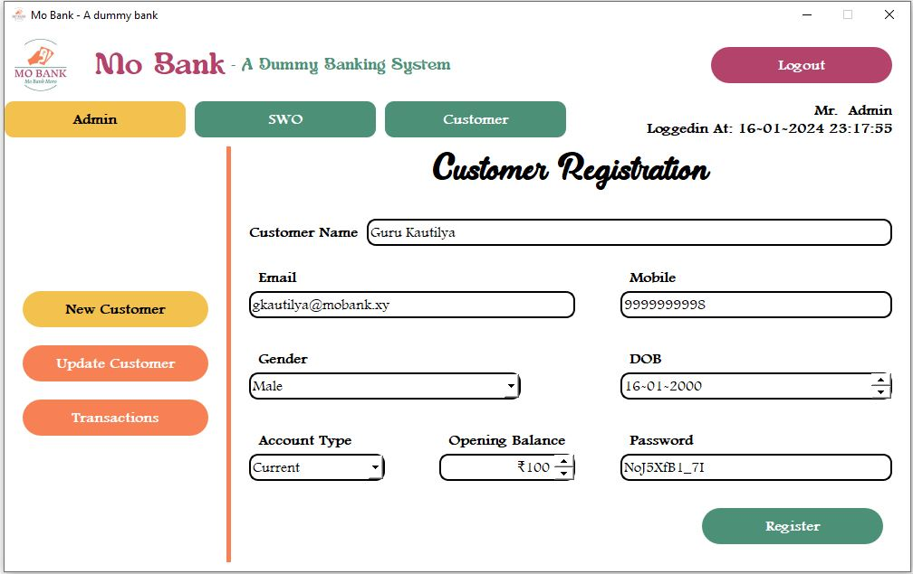
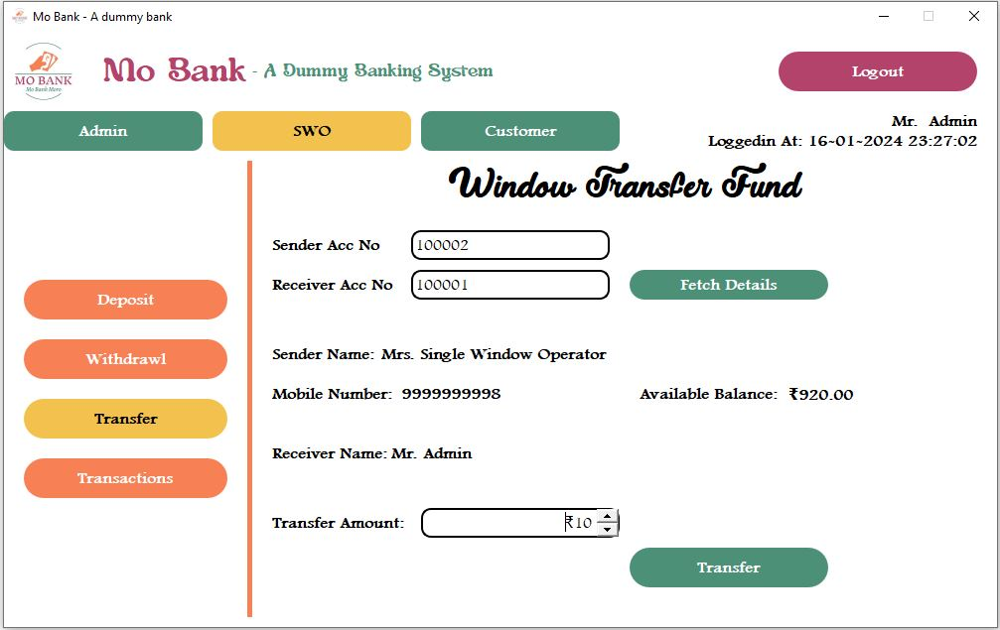

# Mo Bank - Dummy Banking System App

### Overview:
"**Mo Bank**" is a comprehensive dummy banking system app developed as an educational tool for students to learn Python 
programming. This project focuses on providing hands-on experience in GUI interfacing using the PyQt module, along with 
essential concepts like database management and file handling in Python. Through simulation, "Mo Bank" emulates various 
banking functions, fostering a dynamic learning environment for users.

### Key Features:
- #### GUI Interfacing with PyQt:
    Utilizes the **PyQt** module to create an interactive and user-friendly graphical interface. Offers a seamless 
experience for users, ensuring ease of navigation through banking functionalities.

- #### Banking Functions Simulation:
    Simulates fundamental banking operations:
    - Money deposit
    - Withdrawal
    - Fund transfer
    - Account statement generation

- #### User Roles:
    Introduces different user roles to replicate real-world banking scenarios.
    Roles include:
    - Customer
    - Bank Staff (Single Window Operator)
    - Administrator
  
  <br>
  
  During the first run application creates an Administrator with mobile number ```9999999999``` and password 
  ```Hello@123```. To add a new user login using any Administrator and under **Admin** section choose **New Customer**
  and enter the details.

  <br>
  
  To update the user role visit **Update Customer** under **Admin** section.

- #### Database Management:
    Implements database (**SQLite**) functionality to store and retrieve user account information securely. Ensures the integrity and
reliability of user data through effective database management.

- #### File Handling:
    Demonstrates Python's file handling capabilities for tasks such as logging and data storage. Provides insights into 
efficient file handling practices in a banking system.

### Screenshots:
<table style="width: 100%">
  <tr>
    <td></td>
    <td></td>
  </tr>
  <tr>
    <td></td>
    <td></td>
  </tr>
  <tr>
    <td rowspan="2"></td>
    <td></td>
  </tr>
  <tr>
    <td></td>
  </tr>
</table>

### License:
This project is licensed under the [MIT License](./LICENSE).

### Note:
This project is not intended for actual banking transactions and should be used solely for educational and learning 
purposes. Users are encouraged to explore, modify, and enhance the application to deepen their understanding of Python 
programming and its applications in real-world scenarios.

### Advisory:
This program, authored by Asutosh Pati, is intended solely for educational purposes. Unauthorized use of this project 
without the author's explicit consent is strictly prohibited. The program is permitted for teaching purposes only, 
subject to the author's approval, and any other utilization of this software is strictly prohibited.

